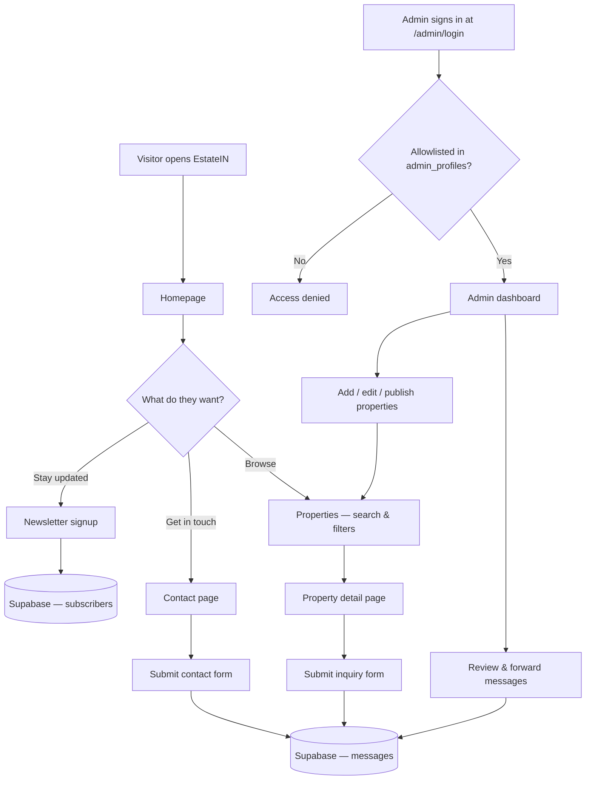
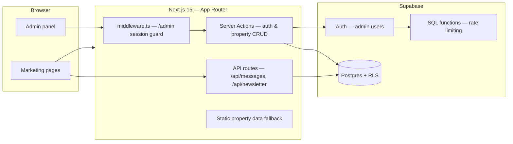

<div align="center">

# EstateIN — Real Estate Platform

### Discover Your Dream Property With Estatein.


**A modern real estate marketing site with live property listings, lead capture, and a secure Supabase-powered admin dashboard — all in one Next.js app.**

[](https://nextjs.org/)
[](https://react.dev/)
[](https://www.typescriptlang.org/)
[](https://tailwindcss.com/)
[](https://supabase.com/)

</div>

---

## Table of Contents

- [Overview](#overview)
- [Key Features](#key-features)
- [User Flow](#user-flow)
- [Architecture](#architecture)
- [Tech Stack](#tech-stack)
- [Quick Start](#quick-start)
- [Pages](#pages)
- [Admin Panel](#admin-panel)
- [Project Structure](#project-structure)
- [Available Scripts](#available-scripts)
- [Environment Variables](#environment-variables)
- [Deployment](#deployment)
- [Security](#security)
- [License](#license)

---

## Overview

**EstateIN** is a production-ready real estate platform built around two experiences:

- A polished **marketing site** — home, property catalog with search and filters, property detail pages with galleries and pricing breakdowns, services, about, testimonials, FAQs, and contact — fully responsive from 360px phones to large desktops.
- A secure **admin dashboard** at `/admin` — manage property listings, review and forward customer messages, and track activity with stats and charts.

Property data and leads live in **Supabase** (Postgres + Auth + Row Level Security). When Supabase isn't configured, the public site gracefully falls back to static property data, so the marketing pages always work.

---

## Key Features

- **Full marketing site** — Home, About, Properties, Services, Contact, FAQs, and Testimonials pages
- **Property catalog** — dynamic listings from Supabase with search, filters, pagination, and a static fallback
- **Property detail pages** — image gallery, key specs, pricing & fee breakdowns, and inquiry form per listing
- **Lead capture** — contact, inquiry, and simple form variants plus newsletter signup, all stored in Supabase
- **Admin dashboard** — stats cards, message-by-type and activity charts, and recent messages at a glance
- **Message management** — read, forward to the Estatein team, resolve, and audit inquiries
- **Property CRUD** — add, edit, publish/unpublish, and feature listings; changes go live immediately
- **Hardened auth** — admin allowlist, email verification, login rate limiting (5 fails → 15-min lockout), RLS everywhere
- **Mobile-first UI** — responsive grids, tablet-aware carousels, hamburger navigation on both site and admin
- **Dark, modern design** — Tailwind CSS 4 design tokens, Urbanist font, Lucide icons

---

## User Flow



---

## Architecture

EstateIN is a **server-rendered Next.js App Router application**. Public pages read published data through RLS-protected queries; the admin panel uses Supabase Auth with server-side session checks on every action.



<table width="100%">
  <thead>
    <tr>
      <th align="left" width="28%">Concern</th>
      <th align="left" width="72%">Approach</th>
    </tr>
  </thead>
  <tbody>
    <tr>
      <td>Rendering</td>
      <td>Next.js App Router — server components, route groups <code>(marketing)</code> and <code>admin</code></td>
    </tr>
    <tr>
      <td>Auth</td>
      <td>Supabase Auth via <code>@supabase/ssr</code>; middleware guards <code>/admin/*</code></td>
    </tr>
    <tr>
      <td>Authorization</td>
      <td>Admin allowlist (<code>admin_profiles</code>) + Row Level Security policies</td>
    </tr>
    <tr>
      <td>Data</td>
      <td>Postgres tables: <code>properties</code>, <code>messages</code>, <code>newsletter_subscribers</code>, <code>admin_login_attempts</code></td>
    </tr>
    <tr>
      <td>Migrations</td>
      <td>Versioned SQL in <code>supabase/migrations/</code>, applied by the Supabase GitHub integration</td>
    </tr>
    <tr>
      <td>Resilience</td>
      <td>Static property dataset keeps the public site working without Supabase</td>
    </tr>
  </tbody>
</table>

---

## Tech Stack

<table width="100%">
  <thead>
    <tr>
      <th align="left" width="28%">Layer</th>
      <th align="left" width="72%">Technology</th>
    </tr>
  </thead>
  <tbody>
    <tr>
      <td>Framework</td>
      <td>Next.js 15 (App Router) + React 19 + TypeScript 5.8</td>
    </tr>
    <tr>
      <td>Styling</td>
      <td>Tailwind CSS 4 (CSS-first <code>@theme</code> tokens)</td>
    </tr>
    <tr>
      <td>Backend</td>
      <td><a href="https://supabase.com/">Supabase</a> — Postgres, Auth, Row Level Security</td>
    </tr>
    <tr>
      <td>Supabase clients</td>
      <td><a href="https://www.npmjs.com/package/@supabase/ssr">@supabase/ssr</a> + <a href="https://www.npmjs.com/package/@supabase/supabase-js">supabase-js 2</a></td>
    </tr>
    <tr>
      <td>Icons</td>
      <td><a href="https://lucide.dev">Lucide React</a></td>
    </tr>
    <tr>
      <td>Linting</td>
      <td>ESLint 9 + <code>eslint-config-next</code></td>
    </tr>
  </tbody>
</table>

---

## Quick Start

### Prerequisites

- [Node.js](https://nodejs.org/) 18+ (20+ recommended)
- npm 9+
- A [Supabase](https://supabase.com/) project (free tier works) — optional for the public site, required for the admin panel

### Setup

```bash
git clone https://github.com/LakiyaDev/EstateIN.git
cd EstateIN

npm install
npm run dev
```

Open the URL shown in the terminal (usually **http://localhost:3000**).

### Supabase setup (admin & live data)

1. Create `.env.local` with the [environment variables](#environment-variables) below
2. Apply the migrations in `supabase/migrations/` (SQL Editor or `supabase db push`)
3. Create an admin user in Supabase Auth and add them to `admin_profiles`
4. Optionally seed the starter listings: `npm run db:seed`

See **[ADMIN_SETUP.md](./ADMIN_SETUP.md)** for the full step-by-step guide.

### Production build

```bash
npm run build
npm start
```

---

## Pages

<table width="100%">
  <thead>
    <tr>
      <th align="left" width="28%">Route</th>
      <th align="left" width="72%">Description</th>
    </tr>
  </thead>
  <tbody>
    <tr>
      <td><code>/</code></td>
      <td>Home — hero, featured properties, testimonials, FAQ</td>
    </tr>
    <tr>
      <td><code>/about</code></td>
      <td>About — journey, values, achievements, team, clients</td>
    </tr>
    <tr>
      <td><code>/properties</code></td>
      <td>Property listings with search, filters, and inquiry form</td>
    </tr>
    <tr>
      <td><code>/properties/[slug]</code></td>
      <td>Property detail — gallery, specs, pricing breakdown, inquiry</td>
    </tr>
    <tr>
      <td><code>/services</code></td>
      <td>Services — valuation, management, investments</td>
    </tr>
    <tr>
      <td><code>/contact</code></td>
      <td>Contact — form, offices, social, gallery</td>
    </tr>
    <tr>
      <td><code>/testimonials</code></td>
      <td>All client testimonials</td>
    </tr>
    <tr>
      <td><code>/faqs</code></td>
      <td>All frequently asked questions</td>
    </tr>
    <tr>
      <td><code>/admin</code></td>
      <td>Admin dashboard (requires Supabase + allowlisted account)</td>
    </tr>
    <tr>
      <td><code>/admin/login</code></td>
      <td>Admin sign-in with rate limiting</td>
    </tr>
  </tbody>
</table>

---

## Admin Panel

<table width="100%">
  <thead>
    <tr>
      <th align="left" width="28%">Section</th>
      <th align="left" width="72%">Description</th>
    </tr>
  </thead>
  <tbody>
    <tr>
      <td>Dashboard</td>
      <td>Stat cards, messages-by-type chart, 6-month activity chart, recent messages</td>
    </tr>
    <tr>
      <td>Messages</td>
      <td>Contact &amp; inquiry submissions — read, forward to the team inbox, resolve</td>
    </tr>
    <tr>
      <td>Properties</td>
      <td>Add, edit, publish/unpublish, and feature listings — updates the live site instantly</td>
    </tr>
  </tbody>
</table>

All three contact form variants (`full`, `simple`, `inquiry`) submit to `/api/messages`; newsletter signups go to `/api/newsletter`.

---

## Project Structure

```
.
├── public/
│   └── images/               # Brand, hero, properties, team, testimonials
├── scripts/
│   ├── download-images.mjs   # Fetch property/site imagery
│   └── seed-supabase.mjs     # Seed starter listings into Supabase
├── src/
│   ├── app/
│   │   ├── (marketing)/      # Home, about, properties, services, contact, faqs, testimonials
│   │   ├── admin/            # Login + (panel): dashboard, messages, properties CRUD
│   │   └── api/              # /api/messages, /api/newsletter
│   ├── components/
│   │   ├── admin/            # Sidebar, tables, charts, property form
│   │   ├── forms/            # ContactForm (3 variants)
│   │   ├── home/             # Hero, carousels, testimonial & FAQ cards
│   │   ├── layout/           # Header, footer, banners, newsletter
│   │   ├── properties/       # PropertyCard, image gallery
│   │   └── ui/               # Pagination, section headings, feature cards
│   ├── data/                 # Static fallback properties & site content
│   ├── lib/
│   │   ├── admin/            # Auth guards, actions, security headers
│   │   ├── data/             # Supabase data access (properties, messages)
│   │   └── supabase/         # SSR/browser clients, middleware, types
│   └── middleware.ts         # /admin session guard
├── supabase/
│   └── migrations/           # Versioned schema: platform, newsletter, auth security
├── ADMIN_SETUP.md            # Full Supabase + admin setup guide
└── package.json
```

---

## Available Scripts

<table width="100%">
  <thead>
    <tr>
      <th align="left" width="32%">Command</th>
      <th align="left" width="68%">Description</th>
    </tr>
  </thead>
  <tbody>
    <tr>
      <td><code>npm run dev</code></td>
      <td>Start the development server</td>
    </tr>
    <tr>
      <td><code>npm run dev:clean</code></td>
      <td>Clear <code>.next</code> cache and start dev server</td>
    </tr>
    <tr>
      <td><code>npm run build</code></td>
      <td>Type-check + production build</td>
    </tr>
    <tr>
      <td><code>npm start</code></td>
      <td>Serve the production build</td>
    </tr>
    <tr>
      <td><code>npm run lint</code></td>
      <td>Run ESLint</td>
    </tr>
    <tr>
      <td><code>npm run db:seed</code></td>
      <td>Seed starter properties into Supabase (needs service role key)</td>
    </tr>
    <tr>
      <td><code>npm run images:properties</code></td>
      <td>Download property images</td>
    </tr>
  </tbody>
</table>

---

## Environment Variables

Create a `.env.local` in the project root:

<table width="100%">
  <thead>
    <tr>
      <th align="left" width="38%">Variable</th>
      <th align="left" width="62%">Description</th>
    </tr>
  </thead>
  <tbody>
    <tr>
      <td><code>NEXT_PUBLIC_SITE_URL</code></td>
      <td>Public site URL (e.g. <code>http://localhost:3000</code>)</td>
    </tr>
    <tr>
      <td><code>NEXT_PUBLIC_SUPABASE_URL</code></td>
      <td>Supabase project URL</td>
    </tr>
    <tr>
      <td><code>NEXT_PUBLIC_SUPABASE_ANON_KEY</code></td>
      <td>Supabase <code>anon</code> public key</td>
    </tr>
    <tr>
      <td><code>SUPABASE_SERVICE_ROLE_KEY</code></td>
      <td><code>service_role</code> key — server-side only, used by <code>npm run db:seed</code></td>
    </tr>
    <tr>
      <td><code>ESTATEIN_TEAM_EMAIL</code></td>
      <td>Team inbox shown for forwarded messages</td>
    </tr>
  </tbody>
</table>

Without Supabase variables, the public site serves static property data and forms show a configuration error on submit.

---

## Deployment

Works on any Node.js host. For **Vercel**:

<table width="100%">
  <thead>
    <tr>
      <th align="left" width="28%">Setting</th>
      <th align="left" width="72%">Value</th>
    </tr>
  </thead>
  <tbody>
    <tr>
      <td>Import</td>
      <td><a href="https://vercel.com/new">vercel.com/new</a> — connect the GitHub repo</td>
    </tr>
    <tr>
      <td>Framework preset</td>
      <td>Next.js (auto-detected)</td>
    </tr>
    <tr>
      <td>Environment</td>
      <td>Add all variables from the table above</td>
    </tr>
    <tr>
      <td>Database</td>
      <td>Migrations auto-apply on push via the Supabase GitHub integration</td>
    </tr>
  </tbody>
</table>

---

## Security

<table width="100%">
  <thead>
    <tr>
      <th align="left" width="28%">Control</th>
      <th align="left" width="72%">Description</th>
    </tr>
  </thead>
  <tbody>
    <tr>
      <td>Admin allowlist</td>
      <td>Only users in <code>admin_profiles</code> can access <code>/admin</code></td>
    </tr>
    <tr>
      <td>Email verification</td>
      <td>Unconfirmed accounts cannot sign in</td>
    </tr>
    <tr>
      <td>Rate limiting</td>
      <td>5 failed logins per email + IP → 15-minute lockout</td>
    </tr>
    <tr>
      <td>Row Level Security</td>
      <td>Public reads limited to published rows; writes require admin</td>
    </tr>
    <tr>
      <td>Server-side guards</td>
      <td>Every admin action re-verifies the session via <code>getUser()</code></td>
    </tr>
    <tr>
      <td>Security headers</td>
      <td><code>X-Frame-Options</code>, <code>X-Content-Type-Options</code>, and more on admin routes</td>
    </tr>
  </tbody>
</table>

---

## License

© LakiyaDeV. All rights reserved.

For licensing questions, open an issue on the [repository](https://github.com/LakiyaDev/EstateIN).

---

<div align="center">

<a href="https://github.com/LakiyaDev/EstateIN">
  
</a>

Built for everyone searching for a place to call home — and the teams who help them find it.

</div>
